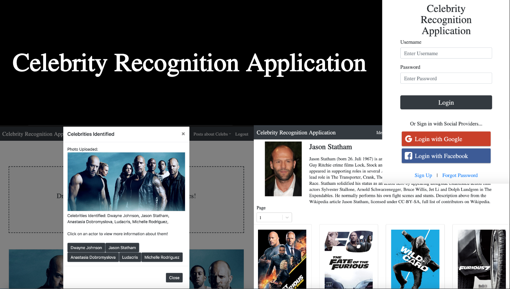
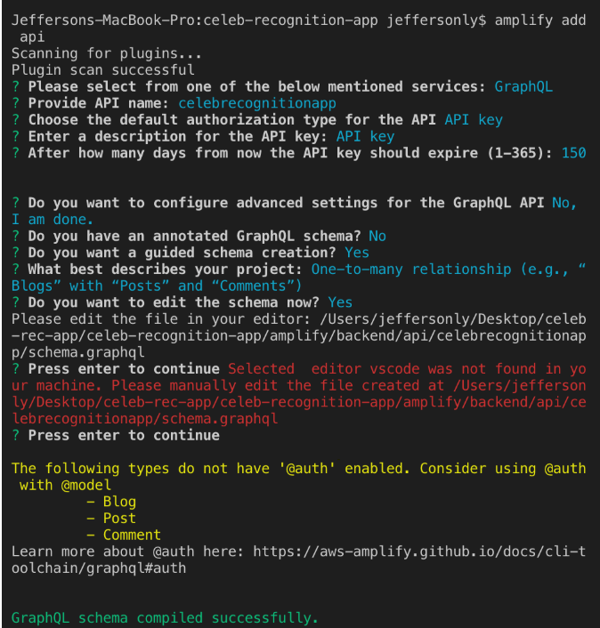
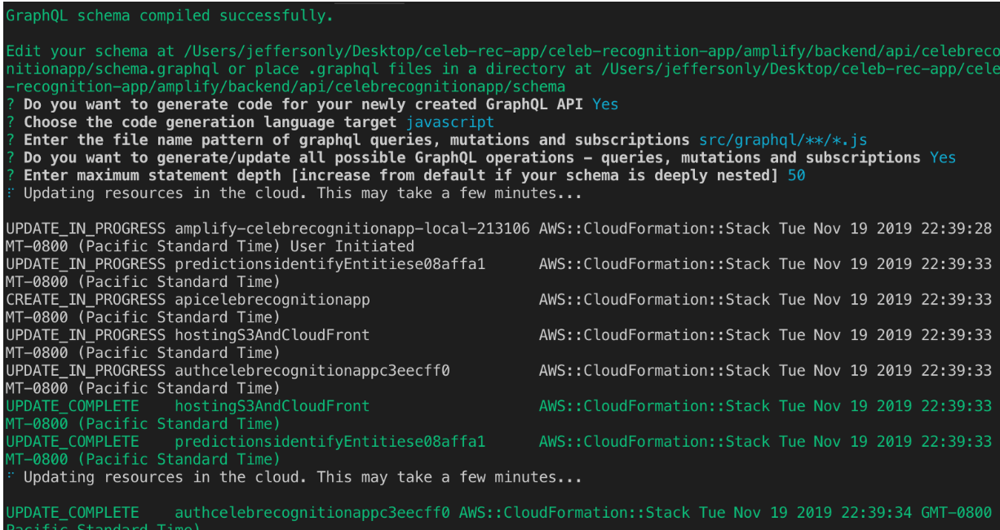
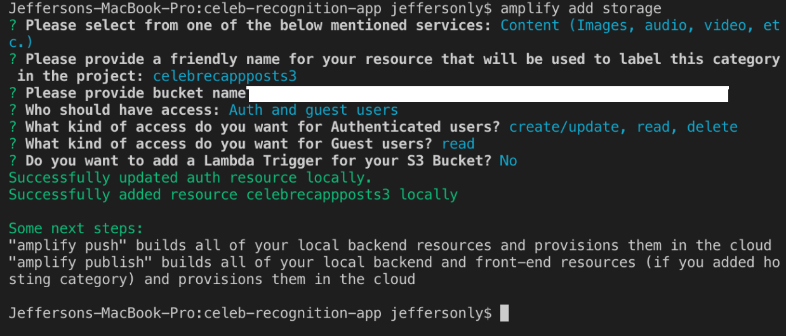
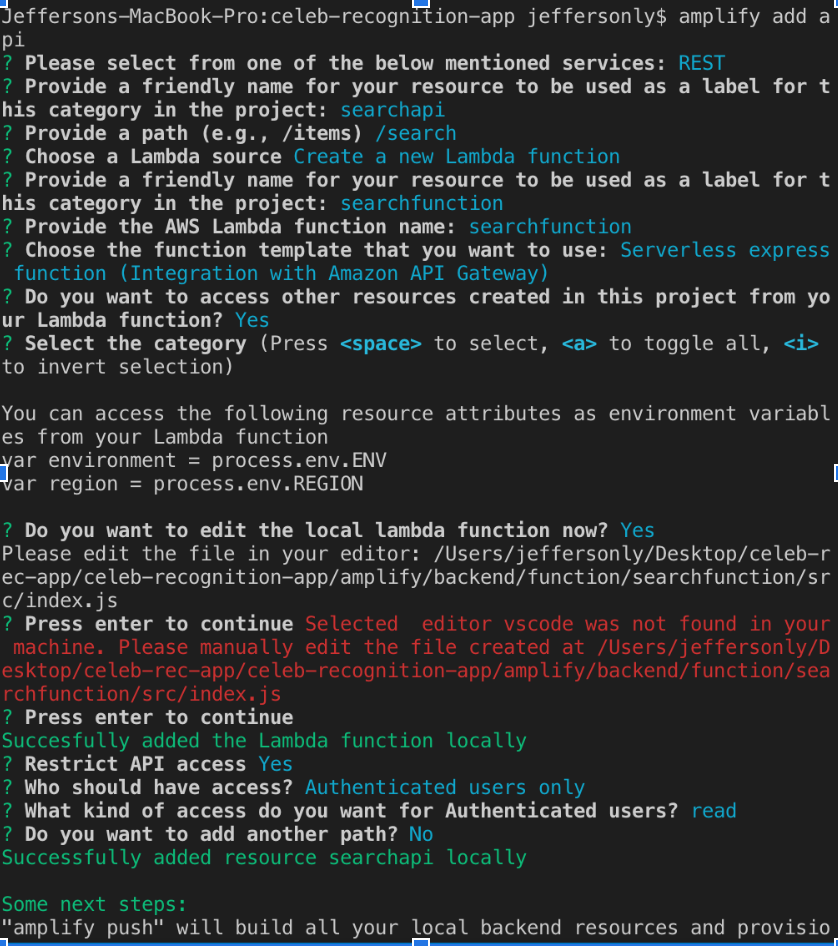

# Celebrity Recognition Application

## Table of Contents

1. [Project Information](#project-information)
2. [Project Introduction](#project-introduction)
3. [Demo](#demo)
4. [Pre-Requisites Set Up](#pre-requisites-set-up)
    -  [Resources to Configure on Cloud Account](#resources-to-configure-on-cloud-account)
    - [Software that is needed to be downloaded Locally](#software-that-is-needed-to-be-downloaded-locally)
    - [Local Configurations](#local-configurations)
5. [How to Set Up & Run the Project Locally](#how-to-set-up-&-run-the-project-locally)

## Project Information

- University Name: [San Jose State University](http://www.sjsu.edu/)
- Course: [Enterprise Software](http://info.sjsu.edu/web-dbgen/catalog/courses/CMPE172.html)
- Professor: [Sanjay Garje](https://www.linkedin.com/in/sanjaygarje/)
- Students: 
    - [Jefferson Ly](https://www.linkedin.com/in/jeffersonly/)
    - [Jonathan Van]()
    - [Hung Tang](https://www.linkedin.com/in/hung-tang-11a7b3b4/)

## Project Introduction

Ever wondered who a celebrity was in a show you watched? Not sure about who the actors in a specific movie are? Really enjoy a specific star in a movie? Well, you've stumbled upon the right application.

The Celebrity Recognition Application can be used to recognize Celebrities within photos! The application allows users to find information about celebrities they may be curious about! They simply have to upload an image to the application, which uses AWS services to identify celebrities, and they will be provided with celebrity names and information. If AWS can't identify the celebrity, many other users may be able to! Our social aspect allows users to create posts and get information from other users.

## Demo

## Pre-Requisites Set Up

### Resources to Configure on Cloud Account
- S3 Bucket Hosting Policies
- Amplify Services (assuming everything configured is correct... and followed from [Local Configurations](#local-configurations)) 
    - All of these resources can be changed to fit your project needs and are/can be configured in different ways 
    - Sets up S3 bucket for you but you have to go into it and configure the following: 
        - Bucket Policies (move data to different storage levels)
        - Disaster Recovery (backup incase something happens)
        - Set Up Multiple Bucket Replication in case of failure (fault tolerance)
    - Sets up API Gateway
    - Sets up Cloud Watch
    - Sets up CloudFront
    - Sets up App Sync
    - Sets up DynamoDB table 
    - Sets up Cognito
    - Used for Hosting Website

### Software that is needed to be downloaded Locally
- A code editor, we used VSCode (Visual Studio Code) to develop the project and highly recommend using it. It has many libraries that you can install for various needs as well as source control. You can find it [here](https://code.visualstudio.com/).

### Local Configurations
- NPM (Node Package Manager) along with Node.js. This is used to install different libraries that we use for our project. You can find instructions on how to install it [here](https://www.npmjs.com/get-npm).
- React.js, this is the framework that we used for building the front end of our application. Instructions on how to install it can be found [here](https://reactjs.org/).
- Amplify CLI, we used amplify heavily for our backend resources. Instructions on how to get started with Amplify and install it can be found [here](https://aws.amazon.com/amplify/framework/).
- Backend resources were generated with AWS Amplify, the following pictures display our configurations/setup for the backend points. However, an 'aws-exports.js' file is needed and must be configured by the user themselves. The graphql config file must also be configured by the user. 
    - To add Amplify Authentication (used for oauth and custom sign in), follow the documentation provided [here](https://aws-amplify.github.io/docs/js/authentication).
    - To add Amplify Predictions (used for AWS Rekognition facial/celebrity recognition), follow the documentation provided [here](https://aws-amplify.github.io/docs/js/predictions).
    - Here are images on how we set up our amplify backend resources: 
        - GraphQL Configuration with AppSync using Amplify APIs (used to store posts/comments and communicate with MongoDB)
        
        
        - S3 Storage Configuration using Amplify Storage (used to store images)
        
        - REST API with Lambda Configurations and API Gateway using Amplify APIs (used to communicate with APIs to pull data)
        
        

## How to Set Up & Run the Project Locally

To set up the project locally, go to the [master branch of the repository](https://github.com/jeffersonly/Celeb-Recognition-App) and clone the project. Then open up the file and run 'npm install' to install all the dependencies needed. After doing so, assuming that the steps in the preconfiguration were followed correctly, you can run 'npm start' and the project should start up on localhost:3000/ 

Note that it is critical to have a working 'aws-exports.js' file. For our project, our team shared the file with one another everytime we made changes to the backend (Amplify).  

